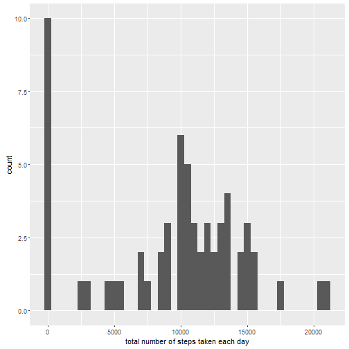
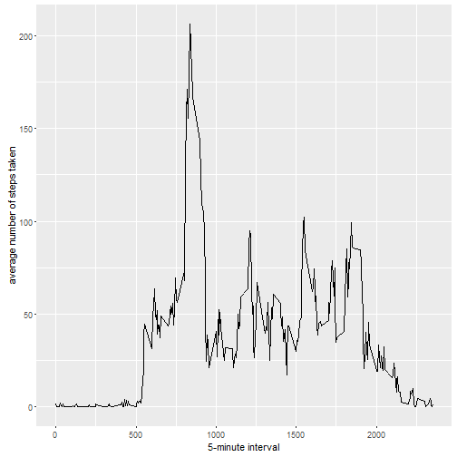
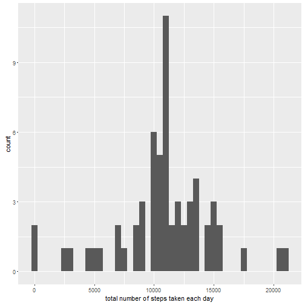

# Reproducible Research: Peer Assessment 1

## Loading and preprocessing the data

```r
unzip(zipfile="activity.zip")
data <- read.csv("activity.csv")
```

## What is mean total number of steps taken per day?

```r
library(ggplot2)
total.steps <- tapply(data$steps, data$date, FUN=sum, na.rm=TRUE)
qplot(total.steps, binwidth=500, xlab="total number of steps taken each day")
```



```r
mean(total.steps, na.rm=TRUE)
```

```
## [1] 9354.23
```

```r
median(total.steps, na.rm=TRUE)
```

```
## [1] 10395
```

## What is the average daily activity pattern?

```r
averages <- aggregate(x=list(steps=data$steps), by=list(interval=data$interval), FUN=mean, na.rm=TRUE)
ggplot(data=averages, aes(x=interval, y=steps)) +
    geom_line() +
    xlab("5-minute interval") +
    ylab("average number of steps taken")
```



Which 5-minute interval, on average across all the days in the dataset, contains the maximum number of steps?


```r
averages[which.max(averages$steps),]
```

```
##     interval    steps
## 104      835 206.1698
```

## Imputing missing values

Total number of missing values in the dataset:


```r
missing <- is.na(data$steps)
table(missing)
```

```
## missing
## FALSE  TRUE 
## 15264  2304
```

All of the missing values are filled in with mean value for that 5-minute interval.


```r
# Replace each missing value with the mean value of its 5-minute interval
fill.value <- function(steps, interval) {
    filled <- NA
    if (!is.na(steps))
        filled <- c(steps)
    else
        filled <- (averages[averages$interval==interval, "steps"])
    return(filled)
}
filled.data <- data
filled.data$steps <- mapply(fill.value, filled.data$steps, filled.data$interval)
```

Make a histogram with the filled data of the total number of steps taken each day and Calculate and report the mean and median total number of steps taken per day.


```r
total.steps <- tapply(filled.data$steps, filled.data$date, FUN=sum)
qplot(total.steps, binwidth=500, xlab="total number of steps taken each day")
```



```r
mean(total.steps)
```

```
## [1] 10766.19
```

```r
median(total.steps)
```

```
## [1] 10766.19
```

Mean and median values are higher after imputing missing data.

## Are there differences in activity patterns between weekdays and weekends?

First, let's find the day of the week for each measurement in the dataset.


```r
filled.data$date <- as.Date(filled.data$date)
filled.data$day <- weekdays(filled.data$date)
filled.data$weekend <- as.factor(ifelse(filled.data$day == "Saturday" | 
                                        filled.data$day ==  "Sunday" , "weekend" , "weekday"))
```

Now let's make a panel plot containing plots of average number of steps taken
on weekdays and weekends.


```r
averages <- aggregate(steps ~ interval + weekend, data=filled.data, mean)
ggplot(averages, aes(interval, steps)) + geom_line() + facet_grid(weekend ~ .) +
    xlab("5-minute interval") + ylab("Number of steps")
```


